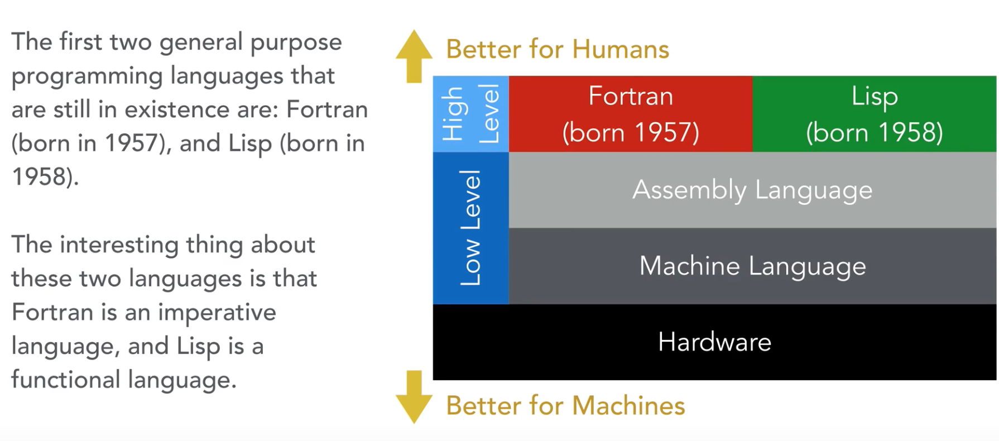

  * [History of Programming Paradigms](README.md#history-of-programming-paradigms)
   * [Imperative Programming](README.md#imperative-programming)
      * [What is meant by imperative programming ?](README.md#what-is-meant-by-imperative-programming-)
      * [Procedural Programming](README.md#procedural-programming)
      * [Object Oriented Programming ](README.md#object-oriented-programming)
   * [Declarative Programming](README.md#declarative-programming)
      * [What is meant by declarative programming ?](README.md#what-is-meant-by-declarative-programming-)
      * [Functional Programming (FP)](README.md#functional-programming-fp)
         * [Pure Functions](README.md#pure-functions)


# History of Programming Paradigms

**How did programming languages orginated**

 <br/>

**How did programming languages evolved till today**

<br/>

[ https://en.wikipedia.org/wiki/Programming_paradigm]

# Imperative Programming

Different generations of programming languages that went through imperative programming paradigm are : 

-   **Machine code** : instructions are given straight to machine. Its only numeric codes. (**First generation** language)
-   **Assembly languages** : instructions are coded to mnemonics. (**Second generation** language)
-   **Procedural languages** : COBOL, BASIC, FORTRAN, C programs (**Third generation** language) 
-   **Object oriented languages** : C++, PHP, Java, Smalltalk

## What is meant by imperative programming ?

-   In imperative programming, the program is just a bunch of statements. Statements means instructions given to computer on how to perform a program. Each <u> statements could change the state </u> of program. 
-   Machine code is purely imperative programming with simple and straight forward instructions for the hardware to work.
-   It is like a recipe which is step of instructions on **how to** make something or do something.
-   The state of program is present in memory for machine code programs. And, modern imperative programs use variable assignments for the same.

## Procedural Programming

-   It is a kind of imperative programming where you could write reusable procedures/functions (which is advanced than simple statements as it controls code duplication. But, these functions are not pure).

## Object Oriented Programming 

-   It is another kind of imperative programming with functions and data bound together into objects itself. Objects talk each other to get things done. State is hold within objects they operate on.

# Declarative Programming

Programming paradigms supporting declarative style are :

-   Functional programming
-   Logic program

## What is meant by declarative programming ?

-   In **Declarative programming** the focus is on what the computer should do rather than how it should do it (eg: SQL) whereas in the Imperative programming the focus is on steps on how the computer should work (eg: C, C++, Java). 
-   In SQL you don't describe the intrinsic details of how the tables are joined or how the index is handled. You just declaratively describe what data is selected/expected from the system.

## Functional Programming (FP)

[ https://medium.com/@sho.miyata.1/the-object-oriented-programming-vs-functional-programming-debate-in-a-beginner-friendly-nutshell-24fb6f8625cc ]

-   It uses only **pure functions**
-   The order of execution of functions are not important.   
    [ https://stackoverflow.com/questions/17826380/what-is-difference-between-functional-and-imperative-programming-languages ]
-   Example of using functional programming style in PHP  
    [ https://www.reddit.com/r/PHP/comments/6vdpaq/real_world_production_examples_of_functional/]
    - `filter, map, reduce` in PHP to make a library in php will behave in a way to not bring any side effects and to not modify input values. (similar to real functional languages)
    - But PHP is not a functional programming language.   
    - Haskell is a pure functional language.

### Pure Functions

-   Clear separation of data and behavior
-   Once an object is created in functional programming, then the **state is immutable** because data is not present within object. Data is separated to somewhere else.
-   It **always return the same response** value for the same input data.
-   Also, they do not modify the input values. It only creates a new result into response (Eg: they don't run foreach loop to change input data, instead they run map on arrays to create another result set)
-   There are **no side effects**.
    [ https://en.wikipedia.org/wiki/Side_effect_(computer_science)]


**Impure Function**

``` js
# example 1. Here, the result is always random.
function number(num){
  num * Math.random()
}

# example 2. Here, the result depends on the global variable value which can change.
var totalPeople = 10
function totalVotes(votes){
 return votes * totalPeople
}
```

**Pure Function**

``` js
# example 1. Here, the result is expected to be same for the same input value forever.
function plusTwo(num){
  return num + 2
}
```

### Advantages of FP over OOP

Functional programming is considered as elegant than OOP due to following reasons :

[ https://blog.learningtree.com/functional-programming-object-orientated-programming/]

-   Abstracting problems into Objects is only useful in high level. But, on drilling down project to details, this analogy no longer becomes useful according to above blog.
-   Tying data + behavior into objects is not very natural.
-   FP is more natural in parallelizing programs as there are no side effects because FP is immutable as there is not data combined with behaviors. (Nothing like state is present in OOP)  
  
    As FP supports parallel programming, it is well **useful in distributed computing model such as blockchain & big data processing**. Because, it helps in creating pure functions and the pure functions can be run in any order, it can be delegated to all the connected clients in blockchain and finally join the results. 
-   If at all you require a sequential processing of results, one idea is to **invoke all the pure functions parallel by using promises** and once all the promises are resolved it can be sequentially processed by using some sequential programming language. **OOP is interaction between objects whereas FP is evaluation of functions.**  
    [ https://bulldogjob.com/articles/792-functional-programming-does-it-work-in-real-life]
-   In OOP developer writes instructions for computer to process (algorithmic steps) whereas in FP developer solves problem as a set of functions to be executed.    
    [ https://www.perlmonks.org/?node_id=983655]  
